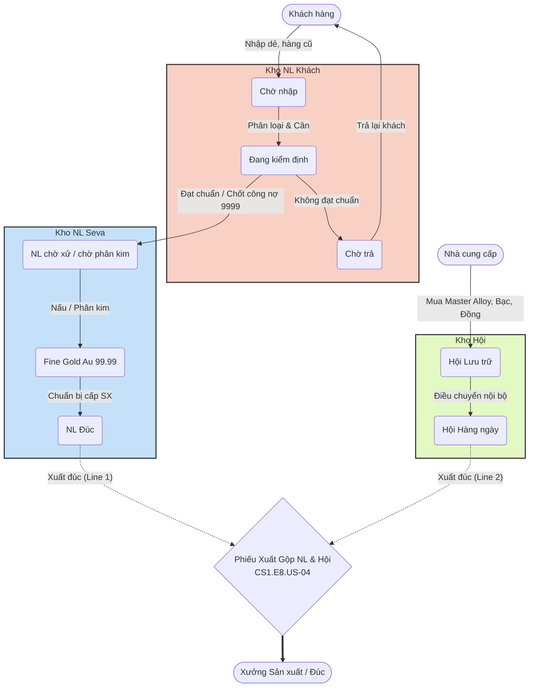

# Luồng Luân Chuyển Tồn Kho (Inventory Flow)

Sơ đồ dưới đây mô tả luồng luân chuyển vật tư giữa 3 phân khu kho chính: **Kho NL Khách**, **Kho NL (Seva)**, và **Kho Hội**. 

```mermaid
graph TD
    %% Định nghĩa các Actor / Nguồn bên ngoài
    CUS([Khách hàng])
    SUP([Nhà cung cấp])
    PROD([Xưởng Sản xuất / Đúc])
    
    %% Kho NL Khách (Ký gửi)
    subgraph Kho_NL_Khach [Kho NL Khách]
        K_ChoNhap(Chờ nhập)
        K_KiemDinh(Đang kiểm định)
        K_ChoTra(Chờ trả)
    end
    
    %% Kho NL Seva (Tài sản công ty)
    subgraph Kho_NL_Seva [Kho NL Seva]
        S_ChoXu(NL chờ xử / chờ phân kim)
        S_FineGold(Fine Gold Au 99.99)
        S_Duc(NL Đúc)
    end
    
    %% Kho Hội (Phụ gia)
    subgraph Kho_Hoi [Kho Hội]
        H_LuuTru(Hội Lưu trữ)
        H_HangNgay(Hội Hàng ngày)
    end
    
    %% Luồng NL Khách
    CUS -- "Nhập dẻ, hàng cũ" --> K_ChoNhap
    K_ChoNhap -- "Phân loại & Cân" --> K_KiemDinh
    K_KiemDinh -- "Không đạt chuẩn" --> K_ChoTra
    K_ChoTra -- "Trả lại khách" --> CUS
    
    %% Luồng chốt quyền sở hữu (Ownership Transfer)
    K_KiemDinh -- "Đạt chuẩn / Chốt công nợ 9999" --> S_ChoXu
    
    %% Luồng Nội bộ Seva
    S_ChoXu -- "Nấu / Phân kim" --> S_FineGold
    S_FineGold -- "Chuẩn bị cấp SX" --> S_Duc
    
    %% Luồng Hội
    SUP -- "Mua Master Alloy, Bạc, Đồng" --> H_LuuTru
    H_LuuTru -- "Điều chuyển nội bộ" --> H_HangNgay
    
    %% Luồng Cấp cho Sản xuất (Casting)
    S_Duc -. "Xuất đúc (Line 1)" .-> PhieuXuatGop{Phiếu Xuất Gộp NL & Hội\nCS1.E8.US-04}
    H_HangNgay -. "Xuất đúc (Line 2)" .-> PhieuXuatGop
    PhieuXuatGop ==> PROD
    
    %% Styling
    classDef cusFill fill:#f9d0c4,stroke:#333,stroke-width:2px;
    classDef sevaFill fill:#c4e1f9,stroke:#333,stroke-width:2px;
    classDef hoiFill fill:#e2f9c4,stroke:#333,stroke-width:2px;
    class Kho_NL_Khach cusFill;
    class Kho_NL_Seva sevaFill;
    class Kho_Hoi hoiFill;
```
