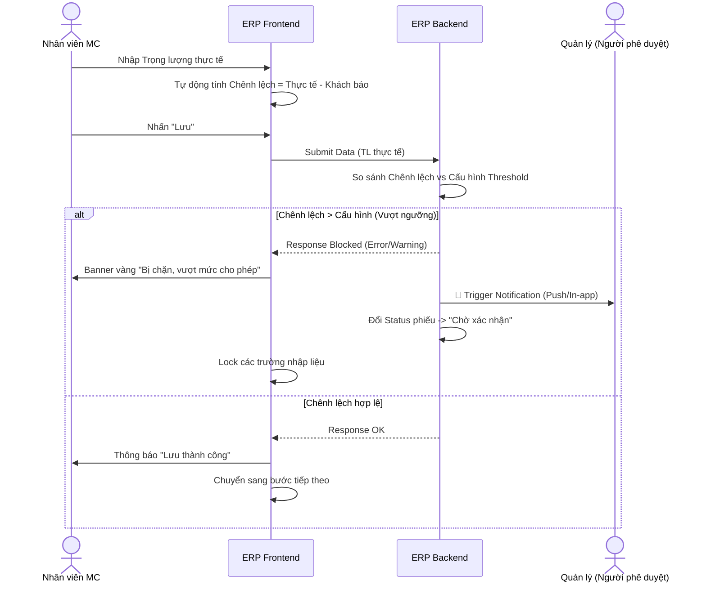

# 🏷️ [CS1.E1.US-04] Nhận NL khách - Kiểm tra: chênh lệch bao bì & Gửi thông báo

**Epic:** Nhận NL khách (CS1.E1)
**Actor:** Nhân viên tiếp nhận nguyên liệu

## 1. USER STORY
- **Là một (As a):** Nhân viên tiếp nhận nguyên liệu
- **Tôi muốn (I want):** Hệ thống tự động kiểm tra và ngăn chặn các thao tác lưu dữ liệu khi phát sinh chênh lệch trọng lượng bao bì vượt mức cho phép, đồng thời gửi thông báo đến cấp quản lý có thẩm quyền.
- **Để (So that):** Đảm bảo mọi rủi ro về thất thoát nguyên liệu được kiểm soát tức thời và việc tiếp nhận chỉ được thực hiện sau khi có sự đồng ý của người quản lý.

---

## 2. TIÊU CHÍ CHẤP NHẬN (ACCEPTANCE CRITERIA - AC)

### AC 1: Gửi thông báo đến người phê duyệt (Notifications)
- **Given (Biết rằng):** Hệ thống đã xác định chênh lệch vượt ngưỡng (TL chênh lệch > Chênh lệch cấu hình).
- **When (Khi):** Nhân viên nhấn "Lưu".
- **Then (Thì):**
  1. Trạng thái phiếu chuyển thành "Đang thực hiện" và hiển thị thêm trạng thái "Chờ xác nhận"
  2. Hệ thống gửi thông báo tức thời (In-app notification) danh sách Người phê duyệt và người theo dõi đã được thiết lập cho nghiệp vụ này.
  3. Nội dung thông báo hiển thị rõ:
     - **VN:** "Phiếu [Mã phiếu] cần phê duyệt do chênh lệch [Loại chênh lệch]: [Giá trị thực tế] (Vượt ngưỡng [Giá trị cho phép])".
     - **EN:** "Ticket [Ticket ID] requires approval due to [Variance Type] variance: [Actual Value] (Exceeds threshold of [Allowed Value])"

---

## 3. THIẾT KẾ (UX/UI) & LUỒNG TƯƠNG TÁC (FLOW)

Để team Outsource Dev & UI hình dung quy trình Block dữ liệu và gửi thông báo, vui lòng tham khảo Sequence Diagram sau:

---

## 4. QUY TẮC NGHIỆP VỤ (BUSINESS RULES)
- **BR-01:** Phiếu ở trạng thái "Chờ phê duyệt" sẽ bị **khóa sửa đổi dữ liệu** đối với nhân viên MC cho đến khi người quản lý có phản hồi (Duyệt hoặc Từ chối).

---

## 5. GHI CHÚ KỸ THUẬT & VALIDATION (TECH NOTES)

### 5.1 Validation Logic
- Logic kiểm tra phải thực hiện ở cả Frontend (để hiển thị UI tức thời) và Backend (để đảm bảo an toàn dữ liệu).
- Click vào thông báo sẽ dẫn trực tiếp đến màn hình chi tiết phiếu cần duyệt.

### 5.2 Technical Note (BA-level)
- Hệ thống phải ghi log: "Hệ thống chặn thao tác do chênh lệch vượt mức tại thời điểm [Timestamp]".

---

## 6. GHI CHÚ CHO QC (TEST CASES)
- **Kiểm tra ngưỡng cận biên:** Ví dụ ngưỡng là `0.05`. Thử nghiệm với `0.049` (Pass), `0.050` (Pass), `0.051` (Block - bị chặn lại).
- **Kiểm tra gửi thông báo:** Xác nhận người quản lý nhận được thông báo đúng nội dung và đúng mã phiếu.
- **Kiểm tra quyền hạn:** Đảm bảo nhân viên không thể tự ý chuyển trạng thái phiếu từ "Chờ phê duyệt" sang "Chờ xử lý" bằng cách nhấn F5 hoặc can thiệp API.
