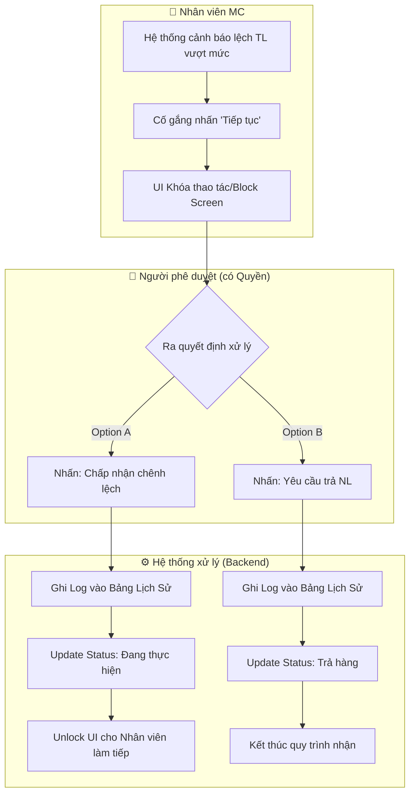

# 🏷️ [CS1.E1.US-05] Nhận NL khách - Xử lý: chênh lệch TL bao bì (Trả/Chấp nhận)

**Epic:** Nhận NL khách (CS1.E1)
**Actor:** Nhân viên MC (Material Control)

## 1. USER STORY
- **Là một (As a):** Nhân viên MC (Material Control)
- **Tôi muốn (I want):** Hệ thống tự động phát hiện, đưa ra cảnh báo và chặn luồng xử lý khi trọng lượng thực tế sai lệch vượt mức cho phép so với thông tin khách báo.
- **Để (So that):** Đảm bảo mọi rủi ro về thất thoát hoặc sai sót nguyên liệu đều phải được cấp quản lý phê duyệt trước khi đưa vào sản xuất/phân kim.

---

## 2. TIÊU CHÍ CHẤP NHẬN (ACCEPTANCE CRITERIA - AC)

### AC 1: Hiển thị cảnh báo chênh lệch vượt mức
- **Given (Biết rằng):** Nhân viên đang ở màn hình chi tiết phiếu tiếp nhận NL (ví dụ: NNL-2601-00001).
- **When (Khi):** Trọng lượng thực tế nhập vào có mức chênh lệch (Difference) so với khách báo lớn hơn giá trị cấu hình (ví dụ: > 1 phân).
- **Then (Thì):** Hệ thống hiển thị Banner cảnh báo màu vàng ở đầu trang với nội dung: "Phát hiện chênh lệch (0.0104 lượng) vượt mức cho phép (0.0100 lượng). Vui lòng ra quyết định xử lý!".
- **And:** Trường "Chênh lệch" được highlight màu đỏ để gây chú ý.

### AC 2: Chặn luồng xử lý và yêu cầu phê duyệt
- **Given (Biết rằng):** Phiếu đang có cảnh báo chênh lệch vượt mức.
- **When (Khi):** Nhân viên MC cố gắng chuyển trạng thái sang bước tiếp theo ("Thông tin nguyên liệu khách").
- **Then (Thì):** Hệ thống chặn thao tác, yêu cầu thực hiện "Chấp nhận chênh lệch" hoặc "Yêu cầu trả NL".

### AC 3: Ghi nhận lịch sử xử lý chênh lệch
- **Given (Biết rằng):** Phiếu đã từng phát sinh chênh lệch và được yêu cầu cân lại hoặc xử lý.
- **When (Khi):** Người dùng xem bảng "Lịch sử xử lý chênh lệch".
- **Then (Thì):** Hệ thống hiển thị đầy đủ thông tin: Lần xử lý, TL khách, TL Seva, Chênh lệch, Người thực hiện, Ngày thực hiện và Ghi chú.

### AC 4: Ra quyết định xử lý (Quản lý)
- **Given (Biết rằng):** Người dùng có quyền duyệt chênh lệch theo cấu hình đang xem phiếu bị chặn.
- **When (Khi):** Quản lý nhấn chọn một trong các hành động:
  - **Chấp nhận chênh lệch (Accept Variance):**
    - Cập nhật lịch sử xử lý chênh lệch.
    - Cập nhật trạng thái sang → Chấp nhận chênh lệch.
    - Ghi nhận người duyệt, ngày duyệt, ghi chú.
    - Cập nhật trạng thái phiếu NNL: Remove trạng thái "Chờ xác nhận" (chỉ còn trạng thái: "Đang thực hiện"), Cho phép thực hiện thao tác tiếp tục (bỏ chặn) ở màn hình Thông tin nguyên liệu khách.
  - **Yêu cầu trả NL (Request Return):**
    - Cập nhật lịch sử xử lý chênh lệch.
    - Cập nhật trạng thái sang → Trả hàng.
    - Ghi nhận người duyệt, ngày duyệt, ghi chú.
    - Cập nhật trạng thái phiếu NNL: Chuyển trạng thái "Chờ xác nhận" sang → Trả hàng (lúc này song song 2 trạng thái: Đang thực hiện và Trả hàng).

---

## 3. THIẾT KẾ (UX/UI) & FLOW TƯƠNG TÁC
 
Thay vì Wireframe tĩnh, đây là Flowchart tương tác giữa Nhân viên, Quản lý và Hệ thống giúp team Code Front-end định hình rõ State Management:

---

## 4. QUY TẮC NGHIỆP VỤ (BUSINESS RULES)
- **BR-01:** Chỉ những user có quyền "Phê duyệt chênh lệch" mới nhìn thấy và tương tác được nút "Chấp nhận chênh lệch"/"Yêu cầu trả NL".

---

## 5. GHI CHÚ KỸ THUẬT & VALIDATION (TECH NOTES)

### 5.1 Validation Logic
- Kiểm tra tính toán chênh lệch realtime so với config.

### 5.2 Field Definition (Action Buttons)
- Nút "Chấp nhận chênh lệch" / "Yêu cầu trả NL": Chỉ enable khi user có role được phân quyền.

---

## 6. GHI CHÚ CHO QC
- Kiểm tra banner cảnh báo.
- Kiểm tra lịch sử xử lý (history logs).
- Kiểm tra phân quyền: Nhân viên MC bình thường không được phép nhấn "Chấp nhận chênh lệch".
