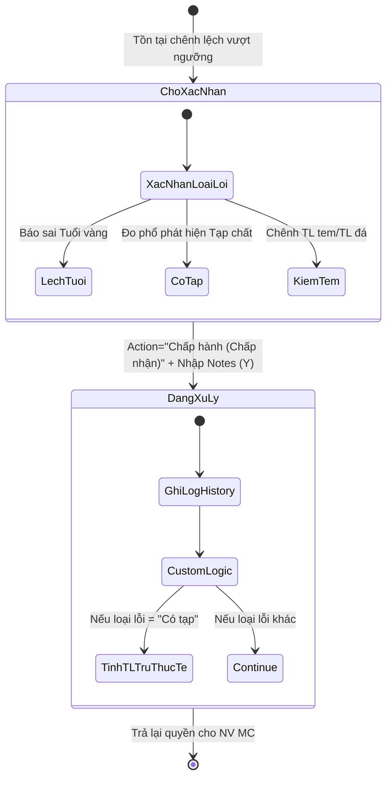

# 🏷️ [CS1.E1.US-13] Nhận NL khách - Xử lý: Chấp nhận chênh lệch (Accept Variance)

**Epic:** Nhận NL khách (CS1.E1)
**Actor:** Người phê duyệt chênh lệch.

## 1. USER STORY
- **Là một (As a):** Người phê duyệt chênh lệch.
- **Tôi muốn (I want):** Xem xét các dòng nguyên liệu có sai lệch vượt ngưỡng và thực hiện đưa ra quyết định.
- **Để (So that):** Chính thức ghi nhận các thông số đo đạc thực tế vào hệ thống và cho phép tiếp tục quy trình.

---

## 2. TIÊU CHÍ CHẤP NHẬN (ACCEPTANCE CRITERIA - AC)

### AC 1: Chấp nhận chênh lệch (Accept Variance) - Chênh lệch Đo phổ
- **Given (Biết rằng):** Người dùng mở phiếu tiếp nhận, Hệ thống hiển thị danh sách các dòng nguyên liệu đã tiếp nhận.
- **When (Khi):** Người dùng chọn dòng nguyên liệu ở trạng thái "Chờ xác nhận".
- **And (Và):** Chọn "Chấp nhận chênh lệch" (từng phiếu, không phê duyệt cùng lúc nhiều phiếu).
- **If (Nếu):**
  - **Lệch tuổi** → Mở popup xác nhận Y/N, nhập ghi chú → chọn Y.
  - **Có tạp** → Mở popup chấp nhận chênh lệch (điền số tuổi trừ thực tế) → Xác nhận.
- **Then (Thì):**
  1. Cập nhật trạng thái dòng nguyên liệu: Từ "Chờ xác nhận" sang → "Đang xử lý".
  2. Cập nhật trạng thái phiếu xử lý chênh lệch: Từ "Chờ xác nhận" sang → "Chấp nhận chênh lệch".
  3. Nếu có tạp → Ghi nhận các thông tin sau vào bảng Có tạp tương ứng ở Tab ghi nhận Đo phổ:
     - Số tuổi trừ (thực).
     - Tuổi - Seva đã trừ (thực).
     - Quy 99.99 - Seva đã trừ (thực).
     - Quy 99.99 - Tổng khách bù (thực).
  4. Ghi nhận ghi chú vào phiếu xử lý chênh lệch.

### AC 2: Chấp nhận chênh lệch (Accept Variance) - Chênh lệch Kiểm tem - Tính đá & Kiểm Mã hàng
- **Given (Biết rằng):** Người dùng mở phiếu tiếp nhận, Hệ thống hiển thị danh sách các dòng nguyên liệu đã tiếp nhận.
- **When (Khi):** Người dùng chọn dòng nguyên liệu ở trạng thái "Chờ xác nhận".
- **And (Và):** Chọn "Chấp nhận chênh lệch" (từng phiếu, không phê duyệt cùng lúc nhiều phiếu).
- **Then (Thì):** Hệ thống mở popup xác nhận Y/N.
- **And (Và):** Người dùng chọn Yes và nhập Ghi chú.
- **Then (Thì):**
  1. Cập nhật trạng thái dòng nguyên liệu: Từ "Chờ xác nhận" sang → "Đang xử lý".
  2. Cập nhật trạng thái phiếu xử lý chênh lệch: Từ "Chờ xác nhận" sang → "Chấp nhận chênh lệch".
  3. Ghi nhận ghi chú vào phiếu xử lý chênh lệch.

---

## 3. THIẾT KẾ (UX/UI) & STATE DIAGRAM

Với team UI/UX outsource, thay vì vẽ Mockup tĩnh, hãy dùng State Machine Diagram này để thiết kế các nút hiển thị tương ứng với từng trạng thái:

---

## 4. QUY TẮC NGHIỆP VỤ (BUSINESS RULES)
- **BR-01:** Chỉ những user có quyền "Phê duyệt chênh lệch" mới nhìn thấy và tương tác được nút "Chấp nhận chênh lệch"/"Yêu cầu trả NL".

---

## 5. GHI CHÚ KỸ THUẬT & VALIDATION (TECH NOTES)

### 5.1 Validation Logic
- Logic kiểm tra quyền và luồng cập nhật trạng thái đồng bộ.

### 5.2 Field Definition (Action Buttons)
- Nút "Chấp nhận chênh lệch": Disable nếu không đủ quyền hoặc sai trạng thái.

---

## 6. GHI CHÚ CHO QC
- Cần verify luồng trạng thái phiếu xử lý chênh lệch đồng bộ với dòng nguyên liệu.
