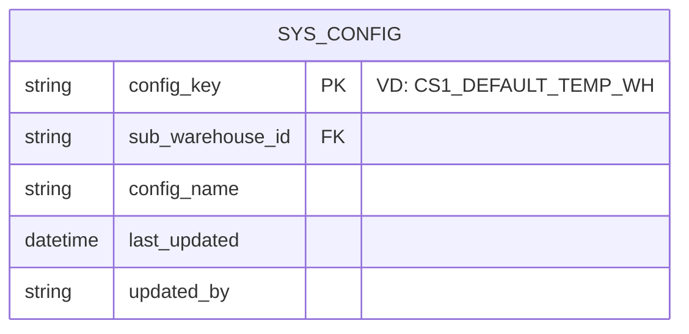

# 🏷️ [CS1.E1.US-15] Nhận NL khách - Thiết lập/chỉnh sửa kho nhận NL khách mặc định

**Epic:** Nhận NL khách (CS1.E1)
**Actor:** Trưởng bộ phận Material Control (TBP MC)

## 1. USER STORY
- **Là một (As a):** Trưởng bộ phận Material Control (TBP MC)
- **Tôi muốn (I want):** Cấu hình thiết lập các nhà kho (Sub-warehouse) mặc định dùng cho luồng Nhận Nguyên Liệu Khách.
- **Để (So that):** Hệ thống lấy giá trị này tự động điền (auto-fill) vào các Form Nhận Hàng và Nhập Kho, giúp nhân viên không phải chọn tay thủ công.

---

## 2. TIÊU CHÍ CHẤP NHẬN (ACCEPTANCE CRITERIA - AC)

### AC 1: Lưu cấu hình kho mặc định
- **Given (Biết rằng):** TBP MC mở phân hệ Cấu hình hệ thống -> tab "Nhận NL Khách".
- **When (Khi):** Hệ thống load dữ liệu cấu hình hiện tại (nếu có).
- **And (Và):** Người dùng thay đổi Dropdown cho 2 trường: (1) Kho Nạp NL Khách và (2) Kho Nhập NL Đã Kiểm.
- **And (Và):** Nhấn "Lưu cấu hình".
- **Then (Thì):** Hệ thống báo lưu thành công và cập nhật cấu hình này cho toàn hệ thống (Global Config).

### AC 2: Apply cấu hình vào Form Nghiệp Vụ
- **Given (Biết rằng):** Đã có cấu hình mặc định (Active).
- **When (Khi):** Nhân viên vào luồng "Tạo phiếu tiếp nhận NL" hoặc "Nhập kho NL khách".
- **Then (Thì):** Trường UI "Nhà Kho" tự động được điền sẵn giá trị lấy từ bảng cấu hình vừa tạo. (User vẫn có thể manual chọn lại nếu muốn).

---

## 3. THIẾT KẾ (UX/UI) & DATA MODEL

**Cấu trúc Table Đề Xuất (Config Table):**

---

## 4. QUY TẮC NGHIỆP VỤ (BUSINESS RULES)
- **BR-01:** (Global Config) Cấu hình này áp dụng **chung cho toàn bộ hệ thống/chi nhánh** tại một thời điểm, không phân quyền theo User.
- **BR-02:** Nếu kho cấu hình mặc định bị "Deactivate" trong Master Data, hệ thống sẽ rơi về trạng thái `NULL` (người dùng sẽ bắt buộc chọn thủ công) và phải cảnh báo vàng cho TBP MC khi vào lại màn hình Cấu hình.

---

## 5. BẢNG ĐỊNH NGHĨA TRƯỜNG DỮ LIỆU (FIELD DEFINITION)

| Tên trường (VN) | Tên trường (EN) | Kiểu dữ liệu | Required | Quy tắc Validation & Constants |
|---|---|---|---|---|
| Kho tiếp nhận NL khách (Tạm) | Receive Warehouse (Temp) | Dropdown | Có | - Source: Lấy danh sách Warehouse (Lọc Type = Kho nguyên liệu/WIP, Status = Active). - Mapping DB Config Key: `CS1_WH_RECEIVE_TEMP` |
| Kho nhập NL đã kiểm (Chính thức) | Inspected Warehouse (Final) | Dropdown | Có | - Áp dụng filter như trên.  - Bắt buộc phải chọn giá trị khác với Kho tiếp nhận tạm. - Mapping DB Config Key: `CS1_WH_INSPECTED_FINAL` |

---

## 6. GHI CHÚ KỸ THUẬT & GHI CHÚ CHO QC 
- **Tech Note:** Cấu hình không nên lưu hardcode dưới DB dạng column riêng lẻ mà nên dùng bảng Pattern Key-Value để dễ dàng expand sau này mà không cần Alter Table.
- **Test Case QC:**
  - Verify cấu hình rỗng -> Vào màn hình nghiệp vụ dropdown nhà kho phải trống.
  - Sau khi save -> Form nghiệp vụ ăn đúng giá trị auto-fill.
  - Chọn 2 kho giống nhau -> Phải báo lỗi validation.
