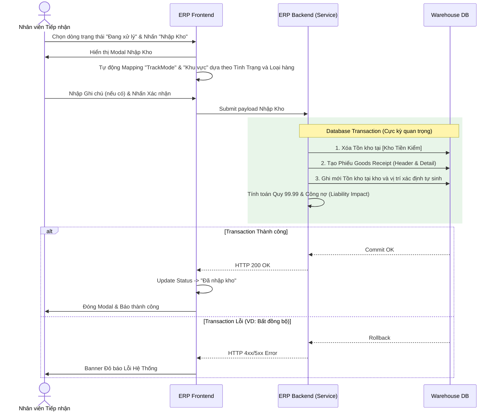

# 🏷️ [CS1.E1.US-16] Nhận NL khách - Nhập kho (Inbound) và In phiếu giao nhận

**Epic:** Nhận NL khách (CS1.E1)
**Actor:** Nhân viên Tiếp nhận

## 1. USER STORY
- **Là một:** Nhân viên tiếp nhận nguyên liệu.
- **Tôi muốn:** Thực hiện nhập kho các dòng nguyên liệu đã hoàn tất đối soát, hệ thống tự động sinh mã Lô (Lot Number) và in nhãn định danh.
- **Để:** Chính thức ghi tăng tồn kho, sẵn sàng cho công đoạn cấp phát sản xuất và đảm bảo tính truy xuất nguồn gốc của vàng.

---

## 2. TIÊU CHÍ CHẤP NHẬN (AC)

### AC1: Nhập kho
- **Given:** Các dòng nguyên liệu đang ở trạng thái **"Đang xử lý"** (đã qua đo phổ/kiểm mã).
- **When:** Nhân viên chọn các dòng có
  - Trạng thái = "Đang xử lý"
  - và, "Quy 99.99 - Seva" không rỗng (> 0)
- **And:** Nhân viên chọn hành động **"Nhập kho" (Stock Inbound)** từ menu thao tác.
- **Then:** Hệ thống hiển thị Modal "Nhập kho"
- **When:** Nhân viên hoàn thành Form là nhấn "Xác nhận"
- **Then:** Hệ thống cập nhật
  - Trạng thái dòng nguyên liệu: từ "Đang xử lý" → "Đã nhập kho"
  - Xóa tồn kho NL khách
    - Xóa tồn các dòng tương ứng tại [kho tiếp nhận NL khách]
  - Tạo phiếu nhập NL (Goods Receipt, bao gồm header và dtl) *(ghi nhận trước, sẽ có màn hình show dữ liệu bảng này. Note ngoài action này, còn nhiều action khác/nguồn khác ghi nhận vào bảng này)*

#### Goods Receipt - Header

| Mã (Code) | Loại (Type) | Mã tham chiếu (Ref Code) | Người nhận (Received by) | Ngày nhận (Received at) |
|---|---|---|---|---|
| Mã phiếu nhập → Phụ lục A - Mã hóa | **Tình trạng** → **Loại** NL khách → L: Công nợ Hàng chờ sửa → G: Hàng khách gửi | Mã phiếu tiếp nhận NL | User thao tác | Datetime |
| | Loại bao gồm: `L`: Công nợ (Liability Receipt) `G`: Hàng khách gửi (Guest) `P`: Công ty tự mua (Purchased) `S`: Vụn từ xưởng (Scrap) `R`: Từ thu hồi (Recovery) `C`: Từ đúc Cast `H`: Từ đúc HTJ | | | |

*#Ghi chú: Mỗi loại là 1 GR khác nhau, tách mỗi loại 1 GR khi nhập 1 lần nhiều loại*

#### Goods Receipt - Detail

| SubWarehouse Kho | Zone Khu vực | Location Vị trí | Item Item | LOT Lô | Qty SL | Lenght Chiều dài | Purity Tuổi | Color Màu | Total Weight Tổng TL | Stone Weight TL đá | Metal Weight TL | 99.99 Equiv. Quy 99.99 | Liability Impact Tính công nợ | 99.99 Equiv. Liability Adjustment Quy 99.99 - Công nợ điều chỉnh | Net 99.99 Equiv. Liability Receipt Quy 99.99 - Công nợ | Labour Cost Giá công |
|---|---|---|---|---|---|---|---|---|---|---|---|---|---|---|---|---|
| | | | | | | | Decimal (10,4) | | | | | | | | | |

*Notes: Value ghi tương tự bảng ghi tồn bên dưới*

- Ghi tồn kho NL theo GR detail (ghi nhận trước, sẽ có màn hình show dữ liệu bảng này. Note ngoài action này, còn nhiều action khác/nguồn khác ghi nhận/cập nhật vào bảng này)

#### Bảng Tồn Cần Ghi (Nguyên liệu)

| Tình trạng (Condition) | Loại (Classification) | → | Kho (SubWarehouse) | Khu vực (Zone) | Vị trí (Location) | Tình trạng trong kho | Item | Lô (LOT) | Tuổi (Purity) | Màu (Color) | SL (Qty) | Chiều dài (Lenght) | Tổng TL (Total Weight) | TL đá (Stone Weight) | TL (Metal Weight) | Quy 99.99 (99.99 Equiv.) | Phương thức quản lý tồn (Track Mode) |
|---|---|---|---|---|---|---|---|---|---|---|---|---|---|---|---|---|---|
| NL khách | Dẻ | → | [kho nhập NL đã kiểm] | WIP *(lưu ý, mặc định tự tạo Zone WIP trong kho)* | WIP *(lưu ý, mặc định tự tạo vị trí WIP thuộc Zone WIP trong kho)* | Chờ xử dẻ KH | Mã Item nhập kho → Phụ lục A - Mã hóa | Mã Lô nhập NL đã kiểm → Phụ lục A - Mã hóa | *= "Tuổi - Seva"* | null | null | null | *= "Tổng TL - Seva"* | *= "TL đá - Seva"* | *= "TL - Seva"* | *= "Quy 99.99 - Seva"* | **W** |
| NL khách | Hàng hồi nấu | → | [kho nhập NL đã kiểm] | WIP *(lưu ý, mặc định tự tạo Zone WIP trong kho)* | WIP *(lưu ý, mặc định tự tạo vị trí WIP thuộc Zone WIP trong kho)* | Chờ xử hàng hồi | Mã Item nhập kho → Phụ lục A - Mã hóa | Mã Lô nhập NL đã kiểm → Phụ lục A - Mã hóa | *= "Tuổi - Seva"* | null | null | null | *= "Tổng TL - Seva"* | *= "TL đá - Seva"* | *= "TL - Seva"* | *= "Quy 99.99 - Seva"* | **W** |
| NL khách | Hàng hồi mới | → | [kho nhập NL đã kiểm] | WIP *(lưu ý, mặc định tự tạo Zone WIP trong kho)* | WIP *(lưu ý, mặc định tự tạo vị trí WIP thuộc Zone WIP trong kho)* | Chờ xử hàng hồi | Mã Item nhập kho → Phụ lục A - Mã hóa | Mã Lô nhập NL đã kiểm → Phụ lục A - Mã hóa | *= "Tuổi - Seva"* | null | null | null | *= "Tổng TL - Seva"* | *= "TL đá - Seva"* | *= "TL - Seva"* | *= "Quy 99.99 - Seva"* | **W** |
| Đơn hàng | Hàng hồi mới | → | [kho nhập TP chờ sửa] | WIP *(lưu ý, mặc định tự tạo Zone WIP trong kho)* | WIP *(lưu ý, mặc định tự tạo vị trí WIP thuộc Zone WIP trong kho)* | Hàng hồi mới | Mã Item nhập kho → Phụ lục A - Mã hóa | Mã Lô nhập NL đã kiểm → Phụ lục A - Mã hóa | *= "Tuổi - Seva"* | null | *= SL Item* | null | *= "Tổng TL - Seva"* | *= "TL đá - Seva"* | *= "TL - Seva"* | *= "Quy 99.99 - Seva"* | **Q+W** |
| Đơn hàng | Hàng gửi sửa | → | [kho nhập TP chờ sửa] | WIP *(lưu ý, mặc định tự tạo Zone WIP trong kho)* | WIP *(lưu ý, mặc định tự tạo vị trí WIP thuộc Zone WIP trong kho)* | Hàng gửi sửa | Mã Item nhập kho → Phụ lục A - Mã hóa | Mã Lô nhập NL đã kiểm → Phụ lục A - Mã hóa | *= "Tuổi - Seva"* | null | *= SL Item* | null | *= "Tổng TL - Seva"* | *= "TL đá - Seva"* | *= "TL - Seva"* | *= "Quy 99.99 - Seva"* | **Q+W** |

*#Ghi chú:*
- TrackMode bao gồm
  - W: chỉ quản lý trọng lượng
  - Q+W: quản lý bằng số lượng và trọng lượng
  - Q+W+H: quản lý bằng số lượng, trọng lượng và chiều dài
- TrackMode ghi nhận nhằm phục vụ công tác nhập/xuất tồn, nhằm xác định key và dữ liệu cần đối chiếu khi ghi nhận hoặc trừ tồn
- Ví dụ:
  - Với record có TrackMode = W → Khi xuất kho, cần xác định trọng lượng xuất, trừ trọng lượng tương ứng khi xuất
  - Với record có TrackMode = Q+W → Khi xuất kho, cần xác định cả số lượng và trọng lượng, trừ số lượng và trọng lượng tương ứng khi xuất
  - ...
- Với thành phần nào không có ở TrackMode, khi ghi tồn → thành phần đó ghi null
  - VD: Nếu record có TrackMode = W → Khi ghi tồn, trường Qty và Lenght = null (Database ghi null).
  - *Về mặt UI/UX: Trên giao diện hiển thị, Frontend tự động mapper các giá trị `null` này thành chuỗi `"N/A"` hoặc `"-"`.*

- **If:** Phiếu NL không còn dòng nguyên liệu ở trạng thái: "Đang xử lý" / "Chờ xác nhận"
- **Then:** Hệ thống cập nhật trạng thái Phiếu tiếp nhận NL từ: "Đang thực hiện" sang → "Hoàn thành"

---

## 3. THIẾT KẾ (UX/UI) & LUỒNG XỬ LÝ (FLOW)
- **Link Figma:** (Theo link mẫu của dự án)

Để hỗ trợ team Outsource dễ dàng hình dung kiến trúc DB Transaction khi thao tác trên Form Nhập Kho (Modal), dưới đây là Sequence Diagram của hệ thống:

## 4. QUY TẮC NGHIỆP VỤ (BUSINESS RULES) *
- **BR-01:** Một GR chỉ bao gồm 1 loại nhập kho (công nợ/công ty mua/,...)

---

## 5. GHI CHÚ KỸ THUẬT & VALIDATION (TECH NOTES) *
### 5.1 Workflow validation
### 5.2 Field Definition Table

| Field Name (VN) | Field Name (EN) | Type | Required | Rules |
|---|---|---|---|---|
| **Tính công nợ** | Liability Impact | Checkbox | Read-only | **Phân loại \| Tình trạng → Tính công nợ** Dẻ \| NL từ khách → Checked Hàng hồi nấu \| NL từ khách → Checked Hàng hồi mới \| NL từ khách → Checked Hàng hồi mới \| Đơn hàng → Unchecked Hàng gửi sửa \| Đơn hàng → Unchecked |
| **Quy 99.99 - Công nợ điều chỉnh** | 99.99 Equiv. Liability Adjustment | Decimal(10,4) | N | Chỉ show khi Tính công nợ = checked - Default = 0, enable cho phép edit - Nếu, dòng NL là dẻ và có Phiếu xử lý chênh lệch   → = "Có tạp"."Quy 99.99 - Tổng khách bù"   *Notes: "Quy 99.99 - Tổng khách bù" ghi nhận giá trị "âm"* |
| **Quy 99.99 - Công nợ** | Net 99.99 Equiv. Liability Receipt | Decimal(10,4) | Read-only | Chỉ show khi Tính công nợ = checked = "Quy 99.99 - Seva" + "Quy 99.99 - Công nợ điều chỉnh" - *Notes: "Quy 99.99 - Công nợ điều chỉnh" có thể mang giá trị âm/dương → Khi đó cộng đúng giá trị âm/dương của "Quy 99.99 - Công nợ điều chỉnh". VD: 100.0000 + (-50.0000) = 50.0000* - Validate: {value} > = 0 |
| **Giá công - Seva** | Labour Cost (Seva) | Currency | N | Chỉ show khi: field "tình trạng" = đơn hàng |
| **Khu vực nhập kho** | Storage Zone | Dropdown | Y | Value = List danh sách khu vực thuộc [kho nhập NL đã kiểm] Default: **Tình trạng → Kho \| Khu vực** NL từ khách → [kho nhập NL đã kiểm] \| WIP Đơn hàng → [kho nhập TP chờ sửa] \| WIP |
| **Vị trí nhập kho** | Location | Dropdown | Y | Value = List danh sách vị trí thuộc khu vực (gán theo define ở mục 2) |
| **Tình trạng** | Condition | Dropdown | Y | Value gán theo define ở mục 2 |
| **Ghi chú** | Remarks | Text Area | N | Max 100 ký tự |

---

## 6. GHI CHÚ CHO QC
- Kiểm tra phiếu GR được tạo, kiểm tra TH 2 loại có tạo thành 2 phiếu riêng
- Kiểm tra thông tin công nợ
- Kiểm tra bảng tồn
- Kiểm tra các field SL, chiều dài, TL ở tồn
- **Luật thép: Trọng lượng không được sai**
