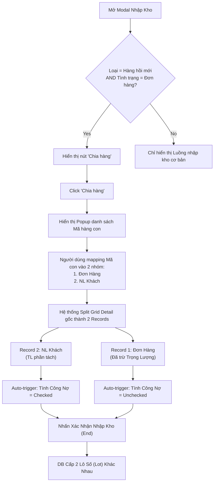

# 🏷️ [CS1.E1.US-16.1] Nhận NL khách - Xử lý: Nhập kho - Tách hàng hồi mới

**Epic:** Nhận NL khách (CS1.E1)
**Actor:** Nhân viên Tiếp nhận (Material Control)

## 1. USER STORY
- **Là một (As a):** Nhân viên tiếp nhận nguyên liệu.
- **Tôi muốn (I want):** Tách một phần dữ liệu của dòng "Hàng hồi mới" (tình trạng: Đơn hàng) chuyển sang tình trạng "NL khách" ngay tại màn hình Nhập Kho.
- **Để (So that):** Có thể linh hoạt tái sử dụng một phần nguyên liệu của đơn hàng trước đó thành nguyên liệu chung của khách gửi (để đúc hoặc phân kim), đồng thời hệ thống tự động cân đối lại trọng lượng và công nợ mà không cần lập phiếu nhận mới.

---

## 2. TIÊU CHÍ CHẤP NHẬN (ACCEPTANCE CRITERIA - AC)

### AC1: Điều kiện hiển thị tính năng "Chia hàng"
- **Given (Biết rằng):** Nhân viên đã chọn dòng nguyên liệu cần nhập và mở Modal (Popup) "Nhập kho".
- **When (Khi):** Hệ thống kiểm tra dữ liệu dòng nguyên liệu thỏa mãn ĐỒNG THỜI 2 điều kiện:
  1. `Loại` = Hàng hồi mới.
  2. `Tình trạng` = Đơn hàng.
- **Then (Thì):** Trên dòng thao tác (hoặc action bar) của record này, hiển thị nút **"Chia hàng"** (Split).

### AC2: Thao tác phân chia nguyên liệu
- **Given (Biết rằng):** Nút "Chia hàng" đang hiển thị.
- **When (Khi):** Bấm "Chia hàng".
- **Then (Thì):** Hệ thống hiển thị Sub-popup (hoặc Drawer) danh sách các **mã hàng** (pieces) đã được kiểm hàng ở bước trước.
- **And (Và):** Cho phép người dùng chuyển (tick/move) các mã hàng này thành 2 rổ:
  - Rổ 1: Giữ nguyên Tình trạng `Đơn hàng`.
  - Rổ 2: Đổi Tình trạng sang `NL khách`.
- **When (Khi):** Bấm Lưu / Xác nhận chia hàng.
- **Then (Thì):** Hệ thống tự động chia record gốc (ở Goods Receipt - Detail) thành **2 records riêng biệt**:
  1. **Record gốc:** `Tình trạng = Đơn Hàng`. Trọng lượng Tổng, TL đá, TL kim loại bị **trừ đi** phần trọng lượng tương ứng với các mã hàng đã bị tách.
  2. **Record mới:** `Tình trạng = NL khách`. Trọng lượng bằng đúng trọng lượng của các mã hàng được đẩy sang Rổ 2.

### AC3: Xử lý Khi Submit Nhập Kho (Generate Lots)
- **Given (Biết rằng):** Màn hình Nhập Kho hiện tại đang có 2 records (gốc và mới) sinh ra từ việc Chia hàng.
- **When (Khi):** Nhân viên điền thông tin kho và nhấn "Xác nhận Nhập kho".
- **Then (Thì):** Hệ thống tiến hành ghi Tồn kho.
- **And (Và):** Cấp phát **2 mã Lô (Lot Number) hoàn toàn khác nhau** cho 2 dòng này.
- **And (Và):** Áp dụng TrackMode (Q+W / W) tương ứng vào từng dòng Tồn kho (như định nghĩa tại US-16).

---

## 3. THIẾT KẾ (UX/UI) & LUỒNG (FLOW)

Để Support team UX vẽ Modal Split, dưới đây là Activity Diagram của tính năng này:

---

## 4. QUY TẮC NGHIỆP VỤ (BUSINESS RULES)

- **BR-01 (Liability Creation):** Mặc dù Record gốc không kích hoạt Tính công nợ (Tình trạng Đơn hàng), Record *được tách ra* (có Tình trạng = NL khách) bắt buộc hệ thống phải **Auto-checked** tham số `Tính công nợ` (Liability Impact) và tự động rải công thức tính cột `Quy 99.99` tương tự như US-16 gốc.
- **BR-02 (Data Isolation):** Việc tách dòng chỉ cập nhật Trình bày và tính toán ở form Nhập Kho. Nó **Không** yêu cầu hệ thống đi update/xóa lại bản ghi tại Bảng "Kiểm mã hàng" ở bước trước. Tức là Bảng "Kiểm mã hàng" mang tính chất lịch sử đối soát và không hồi tố.

---

## 5. GHI CHÚ KỸ THUẬT & VALIDATION (TECH NOTES)

### 5.1 Validation Logic 
- Tổng trọng lượng sau khi chia (Record gốc mới + Record con) dứt khoát phải **Bằng** Tổng trọng lượng Record gốc ban đầu. Không được lệch 0.0001 gam. Nhanh nhất là Backend phải lock kiểm tra Transaction = 0.
- Nút "Chia hàng" bị khóa (Disabled) nếu Số lượng mã con = 1 (vì không thể cắt ra khỏi nó được nữa nếu không xé nhãn).

---

## 6. GHI CHÚ CHO QC (TEST CASES)
- **TC1:** Mock 1 record "Hàng hồi mới - Đơn hàng" có 5 mã hàng. Chia 2 mã hàng sang "NL khách". Verify lưới Data Detail tách thành 2 lines, tổng trọng lượng không đổi.
- **TC2:** Nhấn Submit. Ra kho xem lịch sử Tồn: dòng NL Khách phải có Lot = X, Đơn Hàng có Lot = Y.
- **TC3:** Verify lại phiếu Công nợ xem cột Liability CỦA RIÊNG dòng NL khách (Record 2) có được sinh ra và ghi nhận đúng giá trị Quy 99.99 không.
