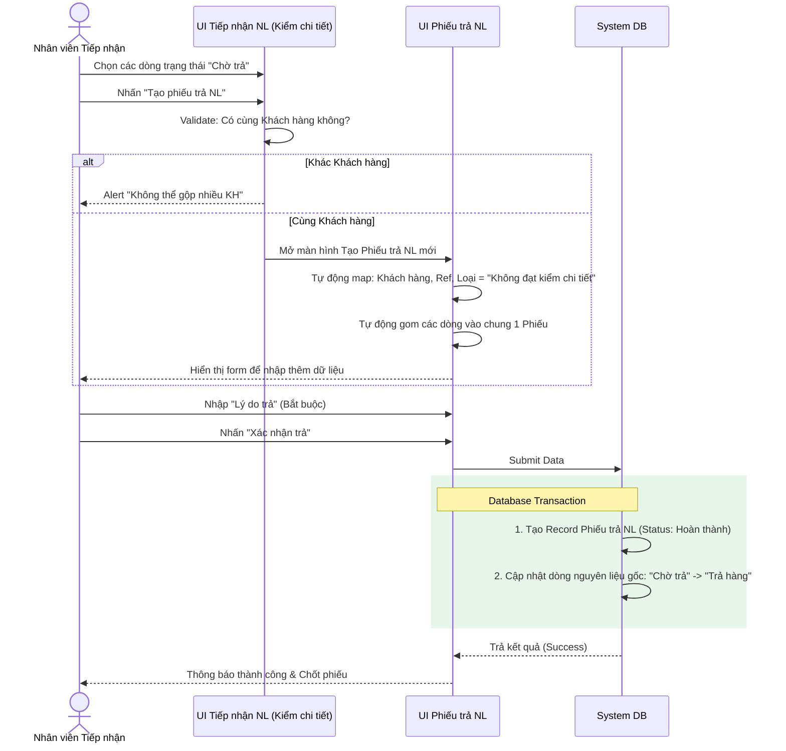

# 🏷️ [CS1.E1.US-21] Phiếu trả NL - Tạo (loại: không đạt kiểm chi tiết)

**Epic:** Nhận NL khách (CS1.E1)
**Actor:** Nhân viên Tiếp nhận / Nhân viên Kiểm tra

## 1. USER STORY
- **Là một:** Nhân viên tiếp nhận nguyên liệu / kiểm tra.
- **Tôi muốn:** Tạo Phiếu trả nguyên liệu (loại: không đạt kiểm chi tiết) cho những dòng nguyên liệu không đạt tiêu chuẩn sau bước Kiểm chi tiết.
- **Để:** Có chứng từ xác nhận việc hoàn trả hàng cho khách và hệ thống tự động loại bỏ các mặt hàng này khỏi luồng xử lý tiếp theo của kho.

---

## 2. TIÊU CHÍ CHẤP NHẬN (AC)

### AC 1: Khởi tạo Phiếu trả từ màn hình Kiểm chi tiết
- **Given:** Nhân viên đang ở màn hình **Tiếp nhận NL**, tại step/tab **Kiểm chi tiết**.
- **And:** Có các dòng nguyên liệu đang ở trạng thái **"Chờ trả"**.
- **When:** Nhân viên tick chọn (các) dòng nguyên liệu này và nhấn **"Tạo phiếu trả NL"**.
- **Then:** Hệ thống tự động điều hướng sang màn hình Tạo Phiếu trả NL mới.
- **And:** Dữ liệu tự động được điền sẵn:
  - Loại phiếu: **"Không đạt kiểm chi tiết"** (Read-only).
  - Khách hàng: Lấy từ phiếu tiếp nhận gốc.
  - Mã tham chiếu: Tham chiếu đến Mã phiếu tiếp nhận gốc tương ứng.
  - Danh sách dòng nguyên liệu: Map đầy đủ thông tin (Item, Lô, Trọng lượng thực tế, Tuổi vàng...) của các dòng vừa chọn.
- **And:** Sau khi tạo phiếu thành công, hệ thống cập nhật trạng thái các đối tượng liên quan:
  - **Phiếu trả NL:** Có trạng thái **"Mới tạo"**.
  - **Record dòng nguyên liệu gốc:** Chuyển từ "Chờ trả" sang **"Đã lên phiếu trả"** (khóa dòng này để không bị chọn trùng lặp).
  - **Phiếu tiếp nhận gốc:** Nếu tất cả các dòng NL của phiếu đều bị trả, chuyển sang trạng thái **"Trả hàng"**. Nếu chỉ trả một phần, giữ nguyên trạng thái **"Đang thực hiện"**.

### AC 2: Gộp nguyên liệu vào chung một Phiếu trả
- **Given:** Nhân viên chọn nhiều dòng nguyên liệu có trạng thái "Chờ trả" tại màn hình Kiểm chi tiết.
- **When:** Nhân viên nhấn "Tạo phiếu trả NL".
- **Then:** Nếu các dòng nguyên liệu này thuộc **cùng một Khách hàng**, hệ thống sẽ **gom chung vào 1 Phiếu trả NL duy nhất**.
- **And:** Nếu user cố tình chọn nhiều dòng thuộc các Khách hàng khác nhau (nếu giao diện Grid cho phép), hệ thống chặn lại và báo lỗi: *"Không thể gộp nguyên liệu của các khách hàng khác nhau vào cùng một phiếu trả."*

### Bắt buộc nhập Lý do trả
- **Given:** Nhân viên đang ở màn hình Tạo/Chỉnh sửa Phiếu trả NL.
- **When:** Nhân viên nhấn "Lưu" hoặc "Xác nhận trả", nhưng có dòng nguyên liệu bị để trống trường **Lý do trả**.
- **Then:** Hệ thống báo lỗi và highlight đỏ trường bị thiếu: *"Vui lòng nhập Lý do trả cho [Mã Item/Lô]."* và không cho phép hoàn tất.

---

## 3. THIẾT KẾ (UX/UI) & LUỒNG XỬ LÝ (FLOW)

Dưới đây là Sequence Diagram mô tả luồng thao tác từ lúc chọn hàng "chờ trả" đến khi chốt phiếu:

---

## 4. QUY TẮC NGHIỆP VỤ (BUSINESS RULES)
- **BR-01:** Tổng trọng lượng trả và trọng lượng từng dòng nguyên liệu phải bằng chính xác với số liệu đã ghi nhận ở bước Nhận/Kiểm tra. Hệ thống khóa (Read-only) các trường trọng lượng trên Phiếu trả.
- **BR-02:** Hàng hóa nằm trong Phiếu trả NL không tạo ra bất kỳ giao dịch nhập/xuất kho chính thức (Goods Receipt / Goods Issue) nào làm ảnh hưởng tới Tồn kho khả dụng (Available Stock), vì hàng không đạt ở bước "Kiểm chi tiết" chưa từng được nhập tồn kho chính thức. Công nợ khách hàng cũng không bị tác động.

---

## 5. GHI CHÚ KỸ THUẬT & VALIDATION (TECH NOTES)

### 5.1 Field Definition Table (Phiếu Trả NL)

| Tên trường (VN) | EN Field Name | Type | Required | Rules |
|---|---|---|---|---|
| Mã phiếu trả | Return Ticket No | Text | Read-only | Sinh tự động theo quy định (Tham chiếu Phụ lục A). |
| Loại phiếu | Ticket Type | Text | Có | Mặc định: `"Không đạt kiểm chi tiết"`. Read-only. |
| Khách hàng | Customer | Link/Text | Có | Map từ phiếu tiếp nhận gốc. Read-only. |
| Tham chiếu NL | Receipt Ref | Link | Có | Link click được về phiếu tiếp nhận nguyên liệu gốc. |
| Mã Item | Item Code | Text | Có | Map từ dòng gốc. |
| Mã Lô | Lot Number | Text | Có | Map từ dòng gốc. |
| Trọng lượng | Weight | Decimal(10,4)| Có | Map từ dòng gốc. Read-only. |
| Lý do trả | Return Reason | Text Area | Có | Bắt buộc nhập cho từng dòng. Max 500 ký tự. |
| Tổng TL trả | Total Return Weight | Decimal(10,4)| N/A | Tính tổng các dòng. Read-only. |

---

## 6. GHI CHÚ CHO QC
- Cố tình chọn 2 dòng thuộc 2 khách hàng khác nhau tại màn hình Tiếp nhận NL và nhấn Tạo phiếu để verify thông báo lỗi.
- Để trống ô "Lý do trả" và thử Nhấn Xác nhận để đảm bảo hệ thống bắt lỗi (required field validation).
- Sau khi phiếu được Xác nhận, quay lại màn hình Tiếp nhận NL để check trạng thái dòng gốc đã đổi thành `"Trả hàng"` hay chưa.
- Kiểm tra báo cáo công nợ / tồn kho: Đảm bảo số lượng của phiếu trả này không được cộng nhầm vào tồn.
