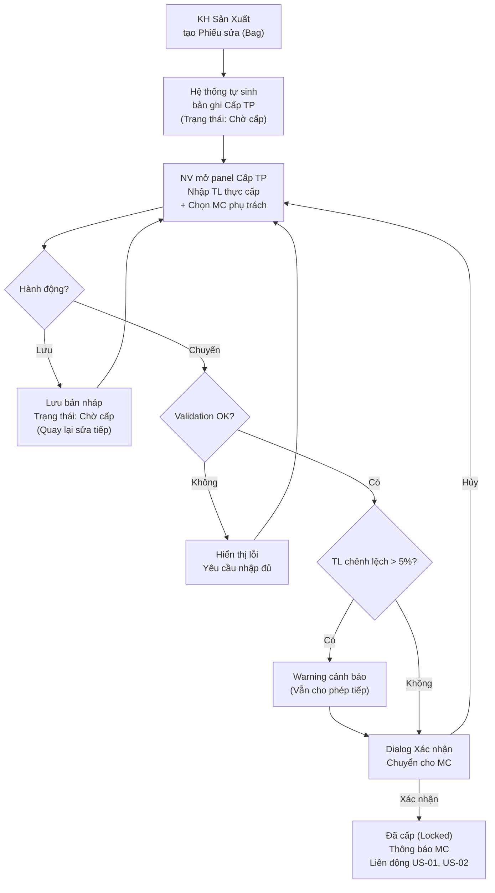

# 🏷️ [CS1.E3.US-04] [Phiếu sửa hàng] - Cấp thành phẩm chờ sửa

**Module:** Xử lý đơn hàng
**Epic:** Quản lý Phiếu sửa hàng
**Actor:** Nhân viên xử lý đơn hàng, Nhân viên kho

## 1. USER STORY
- **Là một (As a):** Nhân viên xử lý đơn hàng / Nhân viên kho
- **Tôi muốn (I want):** Xem danh sách các thành phẩm cần cấp (xuất) cho từng Phiếu sửa hàng (Bag), và thực hiện thao tác cấp thành phẩm cho từng phiếu.
- **Để (So that):** Tôi có thể giao đúng sản phẩm vật lý cho đúng Phiếu sửa (Bag), đảm bảo thợ sửa nhận đủ hàng và hệ thống ghi nhận chính xác việc cấp phát, phục vụ truy vết và kiểm soát hao hụt.

> **Ngữ cảnh:** Khi Kế hoạch sản xuất tạo ra các Phiếu sửa hàng (Bag) ở US-02, hệ thống đồng thời sinh ra các bản ghi "Cấp thành phẩm chờ sửa" tương ứng. Mỗi Phiếu sửa (Bag) sẽ có một yêu cầu cấp thành phẩm đi kèm. Màn hình này cho phép nhân viên xem danh sách các phiếu cần cấp và thực hiện thao tác cấp cho từng phiếu.

---

## 2. TIÊU CHÍ CHẤP NHẬN (ACCEPTANCE CRITERIA - AC)

### AC 1: Xem danh sách Cấp thành phẩm chờ sửa
- **Given (Biết rằng):** Người dùng có quyền truy cập vào menu "Xử lý đơn hàng" > "Cấp thành phẩm chờ sửa".
- **When (Khi):** Người dùng truy cập vào màn hình.
- **Then (Thì):** Hệ thống hiển thị danh sách các yêu cầu cấp thành phẩm cho từng Phiếu sửa hàng (Bag).
- **And (Và):** Mỗi dòng trên bảng tương ứng với **một Phiếu sửa (Bag)** và chứa đầy đủ thông tin sản phẩm cần cấp (Mã hàng, Lô, TL, Tuổi vàng...).
- **And (Và):** Danh sách chỉ hiển thị các phiếu có trạng thái **"Chờ cấp"** (mặc định). Các phiếu đã cấp thành công sẽ chuyển sang trạng thái **"Đã cấp"** và có thể lọc riêng.
- **And (Và):** Danh sách hỗ trợ phân trang (ví dụ: 20 dòng/trang).

### AC 2: Tìm kiếm và Lọc dữ liệu
- **Given (Biết rằng):** Người dùng đang ở màn hình Cấp thành phẩm chờ sửa.
- **When (Khi):** Người dùng sử dụng thanh công cụ tìm kiếm và lọc.
- **Then (Thì):** Người dùng có thể thực hiện:
  - **Tìm kiếm nhanh:** Theo "Mã phiếu (Bag)", "Mã hàng", "Mã lô".
  - **Lọc theo ngày tạo phiếu:** Chọn ngày/khoảng ngày qua Date picker.
  - **Lọc theo trạng thái cấp:** Dropdown (Chờ cấp, Đã cấp, Tất cả).
  - **Lọc theo phân loại:** (Hàng hỏi mới, Hàng gửi sửa).
  - **Nút Refresh:** Click icon reload để làm mới dữ liệu.

### AC 3: Nhập liệu cấp thành phẩm
- **Given (Biết rằng):** Người dùng xem dòng phiếu có trạng thái **"Chờ cấp"**.
- **When (Khi):** Người dùng click vào dòng phiếu trên danh sách.
- **Then (Thì):** Hệ thống mở panel/drawer bên phải (hoặc Expand row), cho phép nhập liệu bổ sung bao gồm:
  - **Thông tin Phiếu sửa (Read-only):** Mã phiếu (Bag), Mã hàng, Số lượng, TL Vàng, Ghi chú lỗi, Công đoạn (WC).
  - **Trường nhập liệu (Editable):**

    | Trường | Kiểu dữ liệu | Required | Ghi chú |
    |---|---|---|---|
    | TL thực cấp | Decimal (4 số lẻ) | Có | Trọng lượng vàng thực tế cân tại thời điểm cấp |
    | MC phụ trách | Dropdown (User List) | Có | Lọc User theo Role = MC (Material Control). Chỉ hiển thị user Active |
    | Ghi chú cấp | Textarea | Không | Ghi chú bổ sung của người cấp (max 500 ký tự) |

  - Hai nút hành động duy nhất: **"Lưu"** và **"Chuyển"**.

### AC 4: Nút "Lưu" (Save Draft)
- **Given (Biết rằng):** Người dùng đã nhập thông tin cấp thành phẩm (có thể chưa đầy đủ).
- **When (Khi):** Người dùng bấm nút **"Lưu"**.
- **Then (Thì):** Hệ thống lưu bản nháp (Draft) với dữ liệu đã nhập.
- **And (Và):** Trạng thái phiếu cấp vẫn giữ nguyên **"Chờ cấp"** (chưa chuyển).
- **And (Và):** Hiển thị thông báo **"Lưu thành công"** (Toast notification).
- **And (Và):** Người dùng có thể quay lại chỉnh sửa tiếp và Lưu nhiều lần trước khi Chuyển.
- **And (Và):** Không bắt buộc điền đủ trường Required khi Lưu.

### AC 5: Nút "Chuyển" (Transfer to MC)
- **Given (Biết rằng):** Người dùng đã điền đầy đủ các trường bắt buộc: `TL thực cấp` và `MC phụ trách`.
- **When (Khi):** Người dùng bấm nút **"Chuyển"**.
- **Then (Thì):** Hệ thống hiển thị **Dialog xác nhận**:
  > _"Bạn có chắc muốn cấp thành phẩm Bag [Mã phiếu] cho MC [Tên MC phụ trách]? Sau khi chuyển, phiếu sẽ không thể chỉnh sửa."_
- **And (Và):** Khi người dùng bấm **"Xác nhận"**:
  1. Trạng thái cấp thành phẩm: `Chờ cấp` → **`Đã cấp`**.
  2. Trạng thái Phiếu sửa hàng (US-02): `Chờ xuất` → **`Đang xử lý`**.
  3. Sản phẩm tương ứng trong "Danh sách thành phẩm chờ sửa" (US-01) chuyển trạng thái `Đã xử lý` / bị loại khỏi view.
  4. Ghi nhận: `issued_at` (thời gian), `issued_by` (người cấp), `assigned_mc` (MC phụ trách), `actual_issued_weight` (TL thực cấp).
  5. **MC phụ trách nhận được thông báo** (In-app Notification) rằng mình đã được giao phiếu sửa mới.
  6. Dòng phiếu chuyển sang chế độ **Read-only** (không cho chỉnh sửa nữa).
- **And (Và):** Khi người dùng bấm **"Hủy"**: Đóng dialog, không thay đổi gì.

### AC 6: Validation khi Chuyển
- **Given (Biết rằng):** Người dùng bấm "Chuyển" nhưng chưa điền đủ thông tin bắt buộc.
- **Then (Thì):** Hệ thống hiển thị thông báo lỗi:
  - Thiếu `TL thực cấp`: _"Vui lòng nhập Trọng lượng thực cấp."_
  - Thiếu `MC phụ trách`: _"Vui lòng chọn MC phụ trách nhận phiếu."_
  - `TL thực cấp` ≤ 0: _"Trọng lượng thực cấp phải lớn hơn 0."_
  - Nếu `|TL thực cấp - TL vàng gốc| / TL vàng gốc > 5%`: Hiển thị **cảnh báo vàng** (Warning, không block): _"TL thực cấp chênh lệch > 5% so với TL ban đầu. Vui lòng kiểm tra lại."_ — Vẫn cho phép Chuyển nếu người dùng xác nhận.
- **And (Và):** Không cho phép Chuyển cho đến khi tất cả validation bắt buộc pass.

### AC 7: Cấp hàng loạt (Bulk Issue) - Tùy chọn
- **Given (Biết rằng):** Người dùng chọn nhiều dòng phiếu (tick checkbox) có trạng thái "Chờ cấp".
- **When (Khi):** Người dùng bấm nút **"Cấp hàng loạt"** trên toolbar.
- **Then (Thì):** Hệ thống hiển thị danh sách tổng hợp các phiếu được chọn, cho phép chọn MC phụ trách chung và yêu cầu xác nhận.
- **And (Và):** Sau khi xác nhận, tất cả các phiếu được chọn sẽ chuyển sang trạng thái `Đã cấp` đồng thời và gán cùng MC phụ trách.

---

## 3. THIẾT KẾ (UX/UI) & HÀNH VI TƯƠNG TÁC
- **Header:** Breadcrumb `Xử lý đơn hàng > Cấp thành phẩm chờ sửa`.
- **Thanh công cụ (Toolbar):** Nút `Bộ lọc`, Ô tìm kiếm, `Ngày tạo` (Date picker), Dropdown `Trạng thái cấp`, Nút `Cấp hàng loạt` (nếu có checkbox được tick), Nút `Refresh`, Nút `Settings` (cài đặt cột).
- **Data Table:**
  - Giao diện dạng list view chi tiết.
  - Có checkbox ở đầu mỗi dòng (phục vụ chọn nhiều để cấp hàng loạt).
  - Cột trạng thái thể hiện qua Badge:
    - **Chờ cấp:** Badge màu vàng cam.
    - **Đã cấp:** Badge màu xanh lá.
- **Panel/Drawer cấp thành phẩm (khi click dòng):**
  - Mở panel bên phải (hoặc Expand row) hiển thị:
    - Phần trên: Thông tin Phiếu sửa (Read-only, background xám nhạt).
    - Phần dưới: Các trường nhập liệu (TL thực cấp, MC phụ trách, Ghi chú cấp).
  - **Hai nút hành động cuối panel:**
    - **"Lưu":** Nút outline/xám, bên trái — Lưu bản nháp, không thay đổi trạng thái.
    - **"Chuyển":** Nút primary/xanh lá, bên phải — Cấp chính thức + Gán MC phụ trách.
  - Sau khi đã Chuyển: Panel hiển thị Read-only, hai nút ẩn, hiển thị thông tin _"Đã cấp bởi [Tên NV] lúc [DD/MM/YYYY HH:mm]. MC phụ trách: [Tên MC]."_

---

## 4. BẢNG ĐỊNH NGHĨA TRƯỜNG DỮ LIỆU (FIELD DEFINITION)

| STT | Tên cột (VN) | Ý nghĩa / Ghi chú | Kiểu dữ liệu | Sortable |
|---|---|---|---|---|
| 1 | `[Checkbox]` | Cho phép chọn 1 hoặc nhiều dòng để thực hiện Cấp hàng loạt | Boolean | Không |
| 2 | Mã phiếu (bag) | Mã định danh duy nhất của Phiếu sửa (Bag ID) tham chiếu từ US-02 | Text (Link) | Có |
| 3 | Lô | Mã lô của sản phẩm | Text | Có |
| 4 | Phân loại | Phân loại hàng (Hàng hỏi mới, Hàng gửi sửa) | Badge/Text | Có |
| 5 | Mã hàng | Mã định danh của sản phẩm | Text | Có |
| 6 | Số lượng | Số lượng món hàng cần cấp | Number | Có |
| 7 | Tuổi | Tuổi vàng quy định (VD: 6100) | Number/Text | Có |
| 8 | Màu | Màu sắc vàng (VD: Y - Yellow, W - White) | Text | Có |
| 9 | TL tổng | Tổng trọng lượng sản phẩm | Decimal (4 số lẻ) | Có |
| 10 | TL đá | Trọng lượng đá | Decimal (4 số lẻ) | Có |
| 11 | TL đá trắng | Trọng lượng đá trắng | Decimal (4 số lẻ) | Có |
| 12 | TL vàng | Trọng lượng vàng nguyên chất | Decimal (4 số lẻ) | Có |
| 13 | Ghi chú lỗi | Mô tả tình trạng lỗi cần sửa | Text | Không |
| 14 | Công đoạn (WC) | Công đoạn / Xưởng sửa sẽ nhận | Text | Không |
| 15 | MC phụ trách | Nhân viên MC được gán nhận phiếu (hiện sau khi Chuyển) | Text | Có |
| 16 | Trạng thái cấp | Tình trạng cấp phát (Chờ cấp / Đã cấp) | Badge | Có |
| 17 | Ngày cấp | Ngày giờ thực hiện Chuyển (hiện sau khi đã cấp) | DateTime | Có |
| 18 | Người cấp | Tên nhân viên thực hiện cấp (hiện sau khi đã cấp) | Text | Không |
| 19 | TL thực cấp | Trọng lượng vàng thực tế đo tại thời điểm cấp | Decimal (4 số lẻ) | Không |
| 20 | `[Action]` | Icon "Xem chi tiết" (khi Đã cấp) | Button/Icon | Không |

---

## 5. QUY TẮC NGHIỆP VỤ (BUSINESS RULES)
- **BR-01 (Nguồn sinh bản ghi):** Danh sách "Cấp thành phẩm chờ sửa" được hệ thống **tự động sinh ra** đồng thời với việc tạo Phiếu sửa hàng (Bag) từ Kế hoạch sản xuất. Mỗi Phiếu sửa (Bag) tương ứng với đúng **một** bản ghi cấp thành phẩm. Không cho phép tạo thủ công.
- **BR-02 (Lưu vs Chuyển):**
  - **Lưu:** Chỉ lưu bản nháp dữ liệu nhập (TL thực cấp, MC phụ trách, Ghi chú). Không thay đổi trạng thái. Có thể Lưu nhiều lần. Không bắt buộc điền đủ trường Required.
  - **Chuyển:** Hành động chính thức cấp thành phẩm + gán MC phụ trách. Phải điền đủ trường Required. Sau khi Chuyển, phiếu bị khóa (Lock), không cho phép chỉnh sửa nữa.
- **BR-03 (Liên động trạng thái khi Chuyển):**

  | Hệ thống | Trước Chuyển | Sau Chuyển |
  |---|---|---|
  | Phiếu cấp TP (US-04) | `Chờ cấp` (Draft) | `Đã cấp` (Locked) |
  | Phiếu sửa hàng (US-02) | `Chờ xuất` | `Đang xử lý` |
  | DS TP chờ sửa (US-01) | Hiển thị | Ẩn / `Đã xử lý` |

- **BR-04 (Ghi nhận TL thực cấp):** Trọng lượng thực cấp (`actual_issued_weight`) là trọng lượng cân thực tế tại thời điểm cấp hàng cho thợ. Dữ liệu này sẽ dùng để **so sánh đối chiếu** với trọng lượng khi thợ trả hàng về sau sửa, nhằm kiểm soát hao hụt vàng.
- **BR-05 (Cảnh báo chênh lệch TL):** Nếu `|TL thực cấp - TL vàng gốc| / TL vàng gốc > 5%`, hiển thị cảnh báo vàng (Warning, không block). Vẫn cho phép Chuyển nếu người dùng xác nhận.
- **BR-06 (Thông báo cho MC):** Sau khi Chuyển thành công, hệ thống gửi **In-app Notification** đến MC phụ trách: _"Bạn được giao phiếu sửa [Mã Bag]. Vui lòng kiểm tra và xử lý."_
- **BR-07 (Ràng buộc cấp):** Chỉ được Chuyển khi:
  - Phiếu sửa hàng (Bag) có trạng thái `Chờ xuất`.
  - Dòng cấp thành phẩm có trạng thái `Chờ cấp`.
  - Không cho phép Chuyển lại cho phiếu đã ở trạng thái `Đã cấp`.
- **BR-08 (Audit Trail):** Mọi thao tác Chuyển đều được ghi log đầy đủ: `issued_by`, `issued_at`, `assigned_mc`, `actual_issued_weight`, `issue_note`. Dữ liệu **không được phép chỉnh sửa** sau khi Chuyển.

---

## 6. LUỒNG XỬ LÝ TỔNG QUAN (FLOW)

