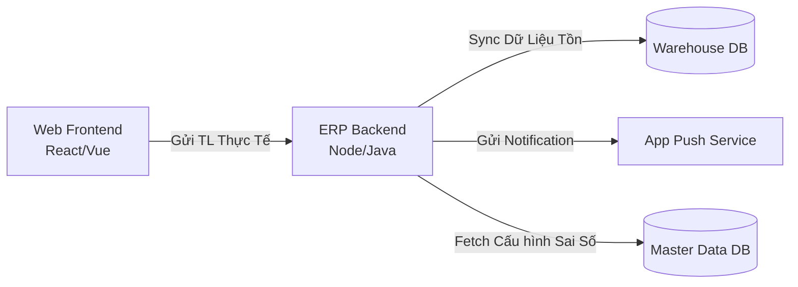

# Phụ Lục: Data Dictionary Thiết Yếu (Outsource Edition)

*Tài liệu này được tạo bởi `@ba-data` để phục vụ team Outsource (Dev & UI/UX), cung cấp "Dữ liệu mầm" (Seed Data) và cấu trúc Master Data mà các User Story CS1.E1 liên tục nhắc đến.*

## 1. Master Data: Tình trạng bao bì
*(Sử dụng trong Dropdown UI của US-04, US-06)*

**Entity Name:** `MD_Packaging_Status`

| Code (ID) | Value (Hiển thị UI) | Description (Ngữ cảnh Business) |
|---|---|---|
| `NGUYEN_VEN` | Nguyên vẹn | Bao bì khách dán niêm phong không có dấu vết rách, bóc. |
| `RACH_NHO` | Rách nhỏ (1-2cm) | Có vết rách xước nhưng đủ nhỏ để không làm rớt kim loại quý. |
| `RACH_TO` | Rách to > 2cm | Rách đủ lớn (nguy cơ cấu thành thất thoát), bắt buộc báo người giám sát. |
| `MAT_NIEM_PHONG` | Mất niêm phong | Không có tem niêm phong hoặc tem đã tái dán. |

## 2. Seed Data: Bảng phân cấp Nhóm / Tên Nguyên Liệu
*(Giúp Dev BE tạo DB migrations và Dev FE mock Dropdown API)*

**Entity Name:** `MD_Material_Category`

| Nhóm Nguyên Liệu (Category) | Tên Nguyên Liệu (Item) | Mã Hàng (Code) | Đặc tính |
|---|---|---|---|
| G (Gold - Vàng) | Vàng dẻo 10K | G_10K_DEO | Hợp kim 41.6% Au |
| G (Gold - Vàng) | Vàng hội 18K | G_18K_HOI | Hợp kim 75.0% Au |
| G (Gold - Vàng) | Vàng nguyên liệu 24K | G_24K_NGUYEN | Vàng > 99.9% Au |
| S (Silver - Bạc) | Bạc 92.5 | S_925 | Bạc tinh khiết 92.5% |

## 3. Data Flow / System Target
Hệ thống tích hợp mà dự án ERP này gọi API tới (Context Architect):

## 4. API Error Handling Constraints (NFR cho Dev)
Các trường hợp Outsource Dev bắt buộc phải chặn (Handle) trong logic Code:
- **Concurrency (Race condition):** Nếu Manager A đang nhấn "Chấp nhận chênh lệch" và Manager B nhấn "Từ chối" cùng một tích tắc, DB Transaction phải khoá bằng Optimistic Locking (dùng `version` tag).
- **Network Timeout:** Khi NV MC nhấn "Lưu", nút bấm phải chuyển sang mode *Loading/Disabled* ngay lập tức, tránh người dùng Click 2 lần tạo ra 2 phiếu NNL ảo.
- **Data Precision:** Toàn bộ dữ liệu Trọng lượng (gram, lượng, phân) phải lưu dưới định dạng `DECIMAL(10,4)` trong Database sql, **không bao giờ** dùng `Floating-point` để tránh sai số dấu phẩy thập phân nghìn tỷ.
