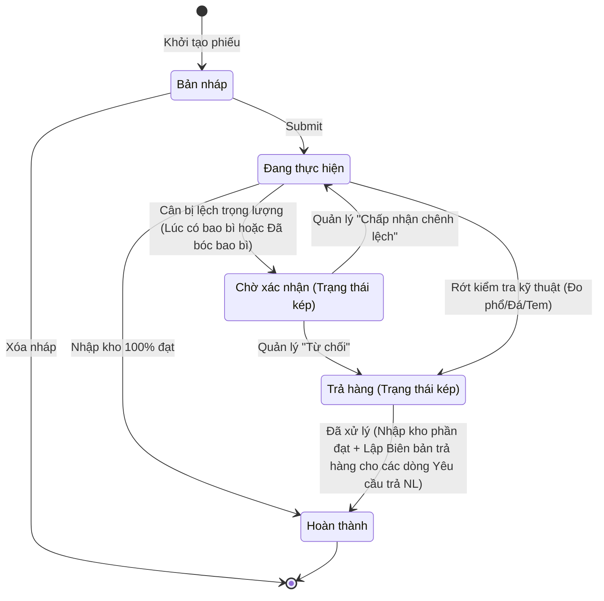
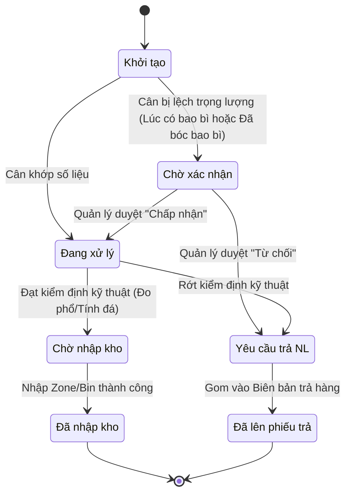
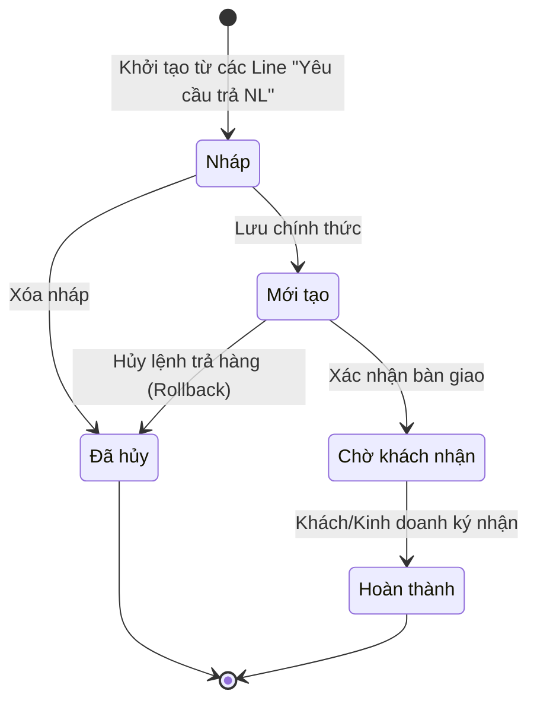

# Sơ đồ Trạng thái (State Machine Diagram) - Tiếp nhận Nguyên liệu

Dựa theo phản hồi của bạn, tôi đã tái cấu trúc lại các sơ đồ, loại bỏ toàn bộ các trạng thái "tự đặt" và **chỉ sử dụng đúng danh sách các trạng thái (Statuses)** đã được định nghĩa cứng trong tài liệu User Stories của Epic `CS1.E1`. Các bước hành động (như Cân Gross, Cân Net) sẽ được chuyển thành các sự kiện (arrows) kích hoạt chuyển đổi trạng thái thay vì làm node.

---

## 1. Trạng thái của Phiếu Tiếp nhận Nguyên liệu (Receipt Ticket)

Phiếu NNL quản lý toàn bộ lô hàng giao đến. Các trạng thái được lấy chính xác từ `US-01`, `US-04`, `US-05`.

> [!NOTE]
> **Giải thích chi tiết về cơ chế Trạng thái kép (Dual-State):**
> 
> Theo tài liệu `CS1_E1_US_04` và `CS1_E1_US_05`, Phiếu NNL không chỉ có một cột Status duy nhất, mà hoạt động với cơ chế 2 trạng thái chạy song song (Primary Status và Sub-Status) khi xảy ra sự cố:
> 
> 1. **Primary Status (Trạng thái chính):** Khi Submit phiếu, trạng thái chính luôn là `Đang thực hiện`. Nó giữ nguyên như vậy suốt quá trình xử lý các line bên trong.
> 2. **Sub-Status (Trạng thái phụ/Ngoại lệ):** 
>    - Khi hệ thống phát hiện lệch cân nặng/bao bì, hệ thống sẽ **"đính kèm thêm"** trạng thái `Chờ xác nhận` vào phiếu. Lúc này phiếu hiển thị: `Đang thực hiện` + `Chờ xác nhận`. Lập tức khóa mọi thao tác của MC.
>    - Khi Quản lý bấm "Từ chối" (Yêu cầu trả NL) cho một line nào đó, trạng thái phụ `Chờ xác nhận` sẽ biến đổi thành `Trả hàng`. Lúc này phiếu hiển thị: `Đang thực hiện` + `Trả hàng`.
>    - Khi Quản lý bấm "Chấp nhận chênh lệch", trạng thái phụ sẽ bị **gỡ bỏ (remove)**, phiếu quay trở lại trạng thái đơn lẻ là `Đang thực hiện` để MC tiếp tục làm việc.
>
> Cách thiết kế này giúp hệ thống biết được tổng thể phiếu vẫn đang "Work in Progress", nhưng đồng thời đang bị "Block" cục bộ ở một điểm nào đó chờ Quản lý giải quyết.

---

## 2. Trạng thái của Từng Dòng Nguyên Liệu (Material Line Item)

Vòng đời độc lập của mỗi dòng chi tiết. Trạng thái lấy từ `US-13`, `US-24.1` và các US đo phổ/kỹ thuật.

---

## 3. Trạng thái của Phiếu Trả NL & Dòng NL Phiếu Trả (Return Ticket)

Biên bản trả hàng (`CS1_E1_US_24.1`) gom các dòng `Yêu cầu trả NL`.

